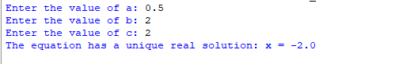
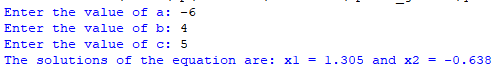
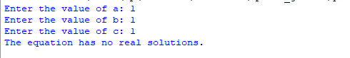

## Description 
This program prompts the user to input the coefficients (a, b, and c) of a quadratic equation. It calculates the discriminant (d) and then determines and displays the solutions of the equation, rounded to three decimal places.
## Example
♡ Example 1  
  
♡ Example 2     
  
♡ Example 3    

